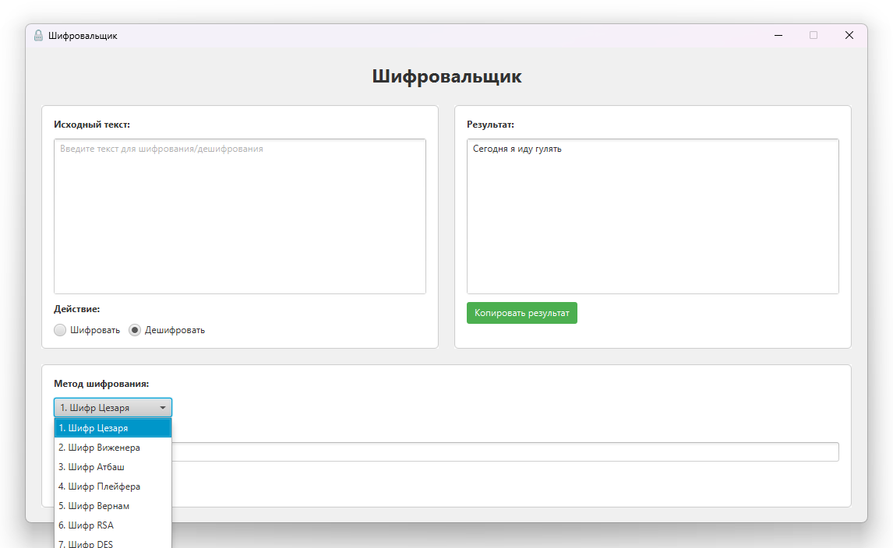
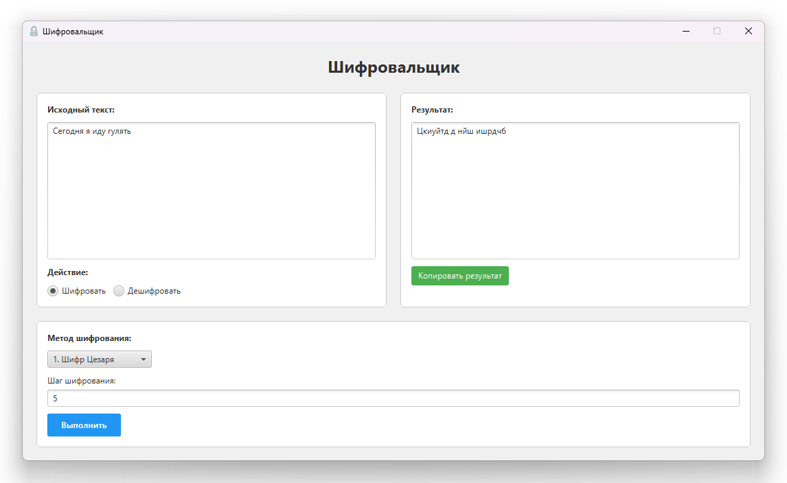

# Encryptuon Application
Encryptuon Application — простое приложение с 7 способами шифрования и дешифрования.  
## 🛠️ Виды шифрования 
  - Шифр Цезаря; 
  - Шифр Виженера;
  - Шифр Атбаш;
  - Шифр Плейфера;
  - Шифр Вернам;
  - Шифр RSA;
  - Шифр DES.

## Главная страница с примерами

## ⚙️ Нюансы
  - RSA не работает корректно из-за ключей.
  - Шифр Плейфера, проблема с повторяющимися символами.
  - С русским алфавитом работают первые 3.
